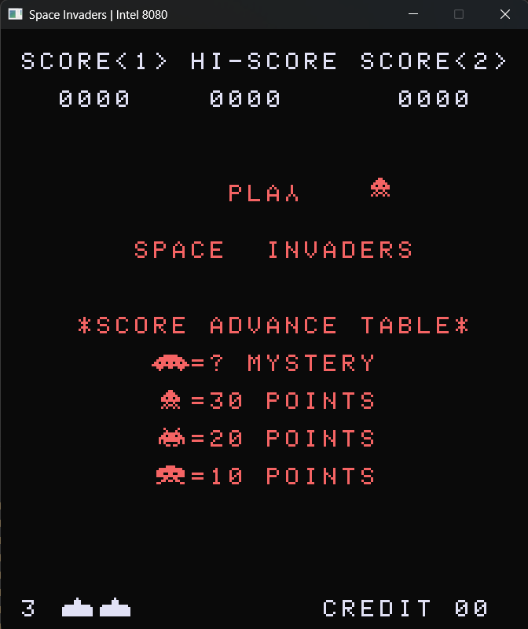
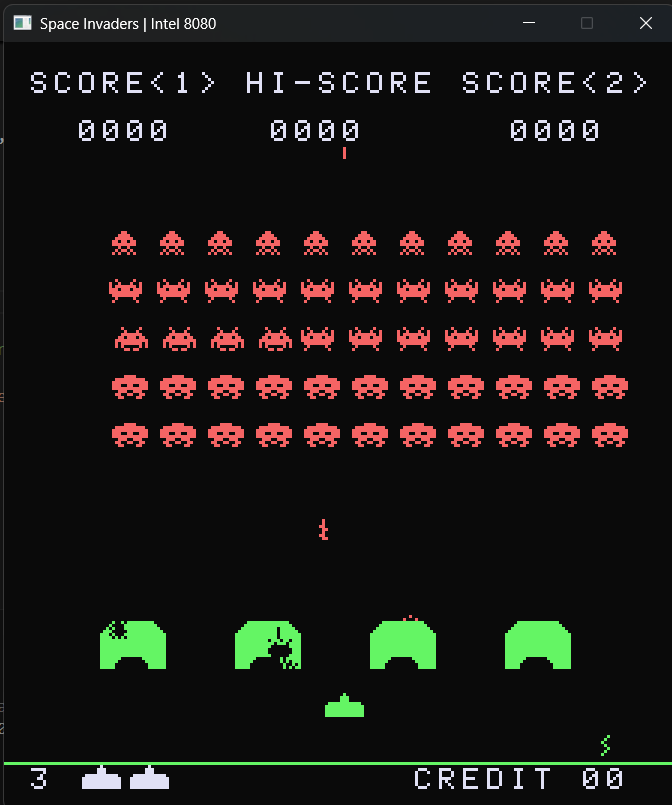

# Space Invaders Arcade emulator.

Uses [r8080](https://github.com/solomonarul/r8080) as the base CPU.

The main thread handles drawing to the screen and the rest is offset to a separate thread for the CPU.

## Status:

    
    

---

<a href="https://brainmade.org/">
    Made with <3 by a human.
    
</a>