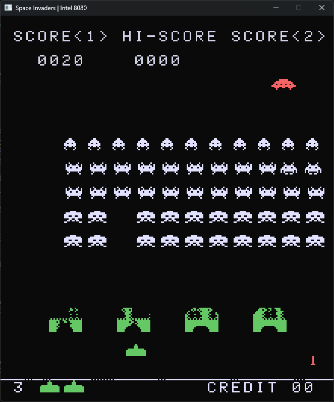

# Space Invaders Arcade emulator.

Uses [r8080](https://github.com/solomonarul/r8080) as the base CPU.

The main thread handles drawing to the screen and the rest is offset to a separate thread for the CPU.

## Controls:

- W - Shoot.
- A, D - Move left / right.
- Space - Insert coin.
- 1 - First player button.

## Status:

- TODO: figure out the insane 20% CPU usage.

    

---

<a href="https://brainmade.org/">
    Made with <3 by a human.
    
</a>